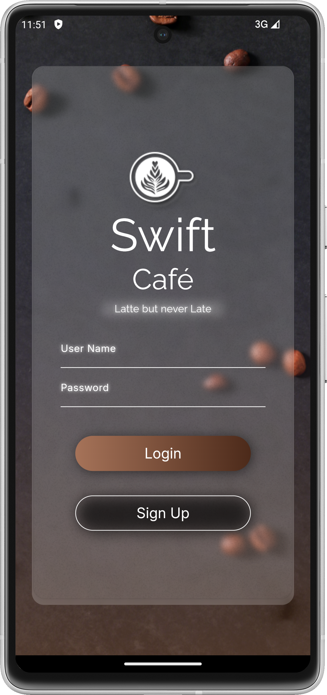
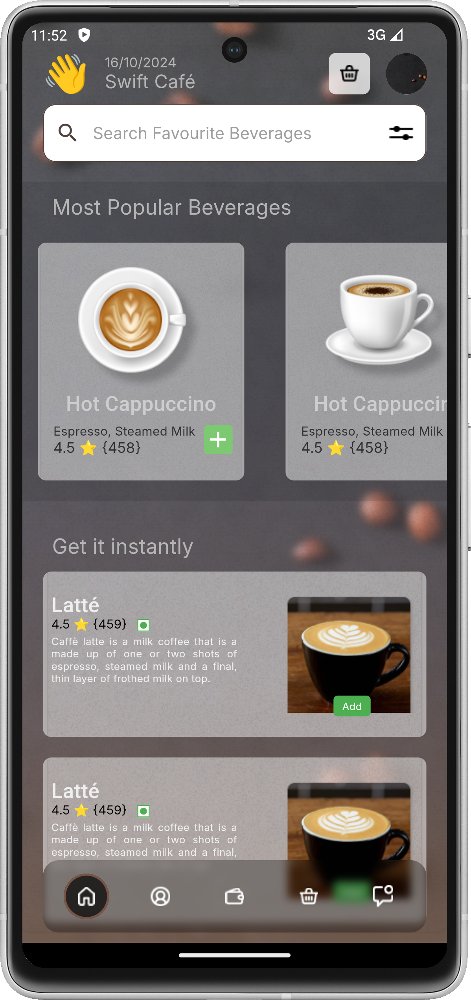
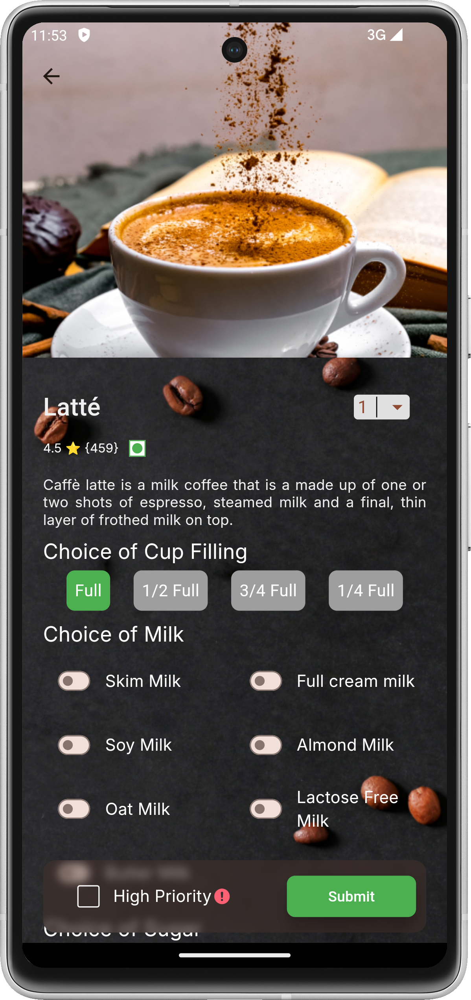

# Swift Cafe

Swift Cafe is a mobile application designed to enhance your coffee experience. With Swift Cafe, you can explore various coffee recipes, manage your favorite coffee, and stay updated with the latest coffee trends.

## Table of Contents
- [Features](#features)
- [Dependencies](#dependencies)
- [Screenshots](#screenshots)

## Features

- **Login Screen**: Simple login screen for user authentication.
- **Home Screen**: Choose from a variety of coffee options.
- **User-Friendly Interface**: Enjoy a clean and intuitive user interface.
- **Details Screen**: Order your coffee with ease.

## Dependencies

- **Flutter**: The app is built using the Flutter framework.
- **Get**: State management solution.
- **Velocity X**: A minimalist Flutter framework.
- **Simple Shadow**: Adds shadow effects to widgets.
- **Intl**: Internationalization and localization support.

## Screenshots
&nbsp;&nbsp;&nbsp;&nbsp;&nbsp;&nbsp;&nbsp;&nbsp;
